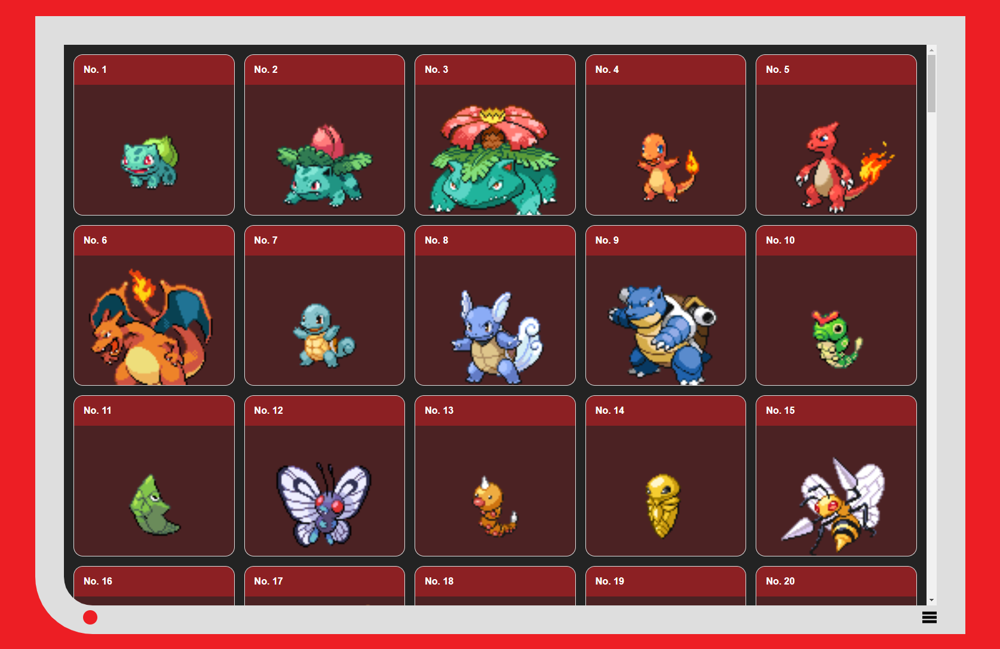
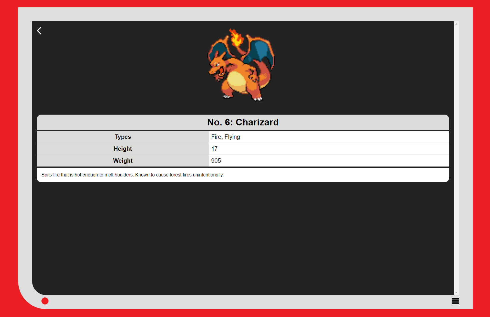

# NextJS Pokemon App

This is a small NextJS Pokémon app that fetches data from [the PokéAPI project](https://pokeapi.co) as a demonstration of how to
port a Next.js app to Astro.

## Details View

## Technical Notes

- No external libraries
- Using the `pages` directory, not the App router beta
- Using CSS Modules for styling
